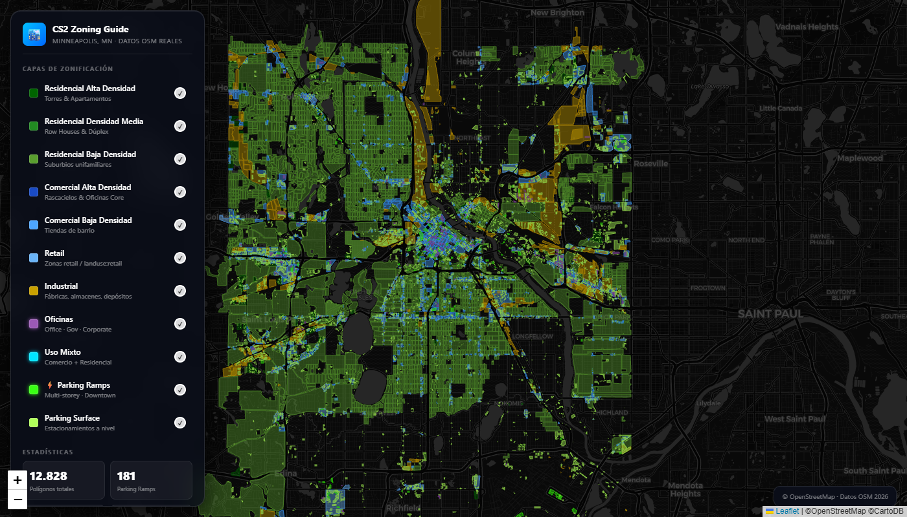

# CS2 Minneapolis Zoning — GIS Extraction Tool v1.0

> Real-world zoning data from OpenStreetMap → Cities: Skylines 2  
> 100% open source · Zero API keys · Runs in ~15 minutes


## Preview



*Interactive zoning map of Minneapolis — CartoDB Dark Matter basemap*


*Downtown Minneapolis — density layers clearly visible*

## What This Does

This tool extracts real-world zoning polygons from OpenStreetMap via the Overpass API and classifies them into Cities: Skylines 2 native zone types automatically. The pipeline is:

```
OpenStreetMap (Overpass API)
        ↓
  extract_zoning.py          ← 8 sequential queries, multi-endpoint retry
        ↓
  datos_zonificacion.js      ← JavaScript arrays with classified polygons
        ↓
  visualizer/index.html      ← Interactive Leaflet.js map
```

No API keys. No paid services. No PostGIS. Just Python + requests.

## Zone Types Mapped

| OSM Tag | Condition | CS2 Zone | Map Color |
|---------|-----------|----------|-----------|
| `landuse=residential` | ≥5 floors or apartments | North American High Density Residential | `#e74c3c` red |
| `landuse=residential` | ≥3 floors or townhouse | North American Medium Density Residential | `#f39c12` orange |
| `landuse=residential` | default | North American Low Density Residential | `#f1c40f` yellow |
| `landuse=commercial` | ≥4 floors | North American High Density Commercial | `#3498db` blue |
| `landuse=commercial` | default | North American Low Density Commercial | `#85c1e9` light blue |
| `landuse=retail` | — | North American Retail Hub | `#6ab4f7` sky blue |
| `landuse=industrial` | — | North American Industrial Zone | `#c8a000` gold |
| `amenity=parking` | multi-storey | Parking Garage / Ramp | `#7f8c8d` dark grey |
| `amenity=parking` | default | Surface Parking Lot | `#95a5a6` grey |
| `building=office` | — | Office / Government Building | `#9b59b6` purple |
| `landuse=mixed` | — | Mixed-Use Development | `#00e5ff` cyan |

See [docs/cs2-zone-reference.md](docs/cs2-zone-reference.md) for the full reference table with gameplay notes.

## Quick Start

```bash
# 1. Clone
git clone https://github.com/Osyanne/cs2-minneapolis-zoning
cd cs2-minneapolis-zoning

# 2. Install uv (if not installed)
curl -LsSf https://astral.sh/uv/install.sh | sh
# Windows: powershell -ExecutionPolicy ByPass -c "irm https://astral.sh/uv/install.ps1 | iex"

# 3. Install dependencies
cd src
uv sync

# 4. Extract data (~10-15 min, downloads from OpenStreetMap)
uv run extract_zoning.py

# 5. Open the visualizer
# The script writes to ../visualizer/datos_zonificacion.js automatically.
# Open visualizer/index.html in your browser.
```

The script will download ~5-6 MB of zoning data from OpenStreetMap across 8 sequential queries. Progress is printed in real time.

## Adapt to Your City

1. Find your city's bounding box using [Nominatim](https://nominatim.openstreetmap.org/) or the optional [bbox-mcp-server](docs/bbox-mcp-server.md)
2. Edit `MINNEAPOLIS_BBOX` in `src/cs2_zones.py`:
   ```python
   MINNEAPOLIS_BBOX = "44.86,-93.38,45.05,-93.17"  # change this
   ```
3. Or pass it as an argument:
   ```bash
   uv run extract_zoning.py --bbox "40.70,-74.02,40.83,-73.91"  # New York example
   ```
4. Open `visualizer/index.html` — the map centers automatically on your data
5. Adjust density thresholds in `src/classifiers.py` if your city has different building patterns

See [docs/adapting-to-other-cities.md](docs/adapting-to-other-cities.md) for a full 5-step guide.

## Methodology

All design decisions — why sequential queries instead of one, why the two-pass density classification, why multi-endpoint rotation — are documented in [METHODOLOGY.md](METHODOLOGY.md).

## Tools Used

- **Python 3.11** + **[uv](https://docs.astral.sh/uv/)** — package management
- **[Overpass API](https://overpass-api.de/)** — OpenStreetMap data extraction (free, no key)
- **[Leaflet.js](https://leafletjs.com/)** — interactive map rendering
- **[CartoDB Dark Matter](https://carto.com/basemaps/)** — basemap (free tile service)

## Optional: bbox-mcp-server

If you use AI assistants (Claude, Copilot, etc.) in your workflow, [bbox-mcp-server](docs/bbox-mcp-server.md) is a community MCP server that lets your AI assistant query bounding boxes directly from OpenStreetMap. It was used during the development of this project to obtain city coordinates without leaving the editor.

## Data Coverage

This release covers the full city of Minneapolis plus immediate border areas:
- **Bounding box:** `44.86,-93.38,45.05,-93.17`
- **Total polygons:** ~1,500+ (varies with OSM updates)
- **Last extracted:** 2026-04-18

## License

MIT — see [LICENSE](LICENSE)  
Map data © OpenStreetMap contributors, available under the [Open Database License (ODbL)](https://www.openstreetmap.org/copyright)
