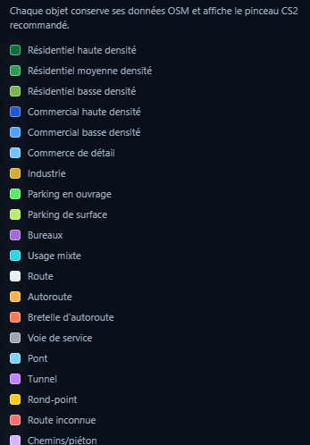

<div align="center">

# 🗺️ Référence des zones CS2
## Tags OpenStreetMap → Cities: Skylines 2

*Table de correspondance utilisée par le pipeline d'extraction.*

---

</div>

## 📑 Table des matières

- [Résidentiel](#résidentiel)
- [Commercial](#commercial)
- [Commerce de détail](#commerce-de-détail)
- [Industrie](#industrie)
- [Parkings](#parkings)
- [Bureaux](#bureaux)
- [Usage mixte](#usage-mixte)
- [Capture de la légende](#capture-de-la-légende)
- [Packs de zones moddés](#packs-de-zones-moddés)

---

## Résidentiel

| Tag OSM | Condition de classification | Libellé CS2 | Couleur du visualiseur | Notes |
|:--------|:----------------------------|:------------|:-----------------------:|:------|
| `landuse=residential` | `building:levels` ou `levels` ≥ 5, ou `residential=apartments/condominium/condo`, ou `building=apartments/residential` | Résidentiel haute densité | `#006400` | Immeubles et grands ensembles résidentiels. |
| `landuse=residential` | `building:levels` ou `levels` ≥ 3, ou `building=terrace/dormitory/townhouse/semidetached_house`, ou sous-type résidentiel équivalent | Résidentiel moyenne densité | `#228B22` | Maisons de ville, dortoirs, petits collectifs. |
| `landuse=residential` | Cas par défaut quand aucun indice de densité fiable n'est disponible | Résidentiel basse densité | `#5a9e2f` | Habitat individuel ou peu dense. |

**Logique associée :** `src/classifiers.py:classify_residential()` et [METHODOLOGY.md §3](../METHODOLOGY.md#3-stratégie-dindex-de-densité-résidentielle).

---

## Commercial

| Tag OSM | Condition de classification | Libellé CS2 | Couleur du visualiseur | Notes |
|:--------|:----------------------------|:------------|:-----------------------:|:------|
| `landuse=commercial` | `building:levels` ou `levels` ≥ 4, ou bâtiment commercial / bureau d'au moins 3 niveaux, ou `shop=mall/department_store`, ou tag `office=*` | Commercial haute densité | `#1a4bc4` | Grands bâtiments commerciaux, bureaux denses, centres commerciaux. |
| `landuse=commercial` | Cas par défaut | Commercial basse densité | `#4da6ff` | Commerces de proximité et zones commerciales peu denses. |

---

## Commerce de détail

| Tag OSM | Condition de classification | Libellé CS2 | Couleur du visualiseur | Notes |
|:--------|:----------------------------|:------------|:-----------------------:|:------|
| `landuse=retail` | Toute zone correspondante | Commerce de détail | `#6ab4f7` | Centres commerciaux, corridors de commerces, grandes zones de vente. |

---

## Industrie

| Tag OSM | Condition de classification | Libellé CS2 | Couleur du visualiseur | Notes |
|:--------|:----------------------------|:------------|:-----------------------:|:------|
| `landuse=industrial` | Toute zone correspondante | Industrie | `#c8a000` | Usines, entrepôts, logistique. |
| `building=industrial/warehouse/factory` | Bâtiment capturé sans `landuse=industrial` explicite | Industrie | `#c8a000` | Même catégorie, détectée via le tag `building`. |

---

## Parkings

| Tag OSM | Condition de classification | Libellé CS2 | Couleur du visualiseur | Notes |
|:--------|:----------------------------|:------------|:-----------------------:|:------|
| `amenity=parking` | `parking=multi-storey/multistorey/structure/underground`, ou `building=parking/garage/garages` | Parking en ouvrage | `#39ff14` | Parking à étages, structure dédiée ou parking souterrain. |
| `amenity=parking` | Cas par défaut | Parking de surface | `#b0ff5a` | Stationnement au sol. |

---

## Bureaux

| Tag OSM | Condition de classification | Libellé CS2 | Couleur du visualiseur | Notes |
|:--------|:----------------------------|:------------|:-----------------------:|:------|
| `building=office` | Objet non déjà capturé comme commercial | Bureaux / administration | `#9b59b6` | Immeubles tertiaires, administrations, sièges sociaux. |
| `office=*` | Objet non déjà capturé comme commercial | Bureaux / administration | `#9b59b6` | Même catégorie. |
| `landuse=office` | Objet non déjà capturé comme commercial | Bureaux / administration | `#9b59b6` | Même catégorie. |

**Déduplication :** les objets déjà présents dans la passe `commercial` sont ignorés dans la passe `office`. Voir [METHODOLOGY.md §6](../METHODOLOGY.md#6-déduplication-commercial--bureaux).

---

## Usage mixte

| Tag OSM | Condition de classification | Libellé CS2 | Couleur du visualiseur | Notes |
|:--------|:----------------------------|:------------|:-----------------------:|:------|
| `landuse=mixed` | Toute zone correspondante | Usage mixte | `#00e5ff` | Zone combinant plusieurs usages urbains. |
| `building=mixed_use` | Bâtiment capturé sans `landuse=mixed` explicite | Usage mixte | `#00e5ff` | Même catégorie. |

---

## Capture de la légende

<div align="center">



*Aperçu de la légende dans le visualiseur Leaflet.*

</div>

---

## Packs de zones moddés

Les libellés visibles sont centralisés dans `CS2_LABELS` dans `src/cs2_zones.py`.

Si vous utilisez un pack de zones moddé, adaptez seulement ces libellés :

```python
CS2_LABELS = {
    "res_high": "Résidentiel haute densité",
    "res_med": "Résidentiel moyenne densité",
    "res_low": "Résidentiel basse densité",
    # ...
}
```

La logique de classification dans `src/classifiers.py` reste indépendante des noms affichés.

---

<div align="center">

📄 *Référence des zones — Projet d'extraction CS2 de zonage réel*
📝 Sous licence MIT

</div>
